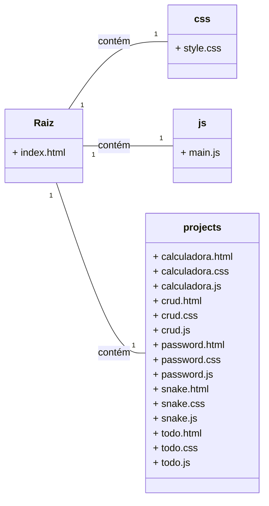

# 💻 Portfólio Alexsandro Almeida - Projetos Estáticos

Este repositório contém o portfólio pessoal de Alexsandro Almeida, composto por uma coleção de mini-aplicativos desenvolvidos usando **HTML, CSS e JavaScript puro** (Vanilla JS).

O projeto foi reestruturado de um Web Service (Hono/Vite) para um **Static Site** (Site Estático), otimizado para o deploy na plataforma **Render**.

## 🚀 Tecnologias Utilizadas

* **HTML5:** Estrutura das páginas.
* **CSS3:** Estilização e responsividade.
* **JavaScript (Vanilla JS):** Lógica e interatividade de todos os mini-aplicativos.
* **Render:** Plataforma de hospedagem para Static Sites.

## 📦 Estrutura do Projeto

O projeto segue uma estrutura de pastas limpa e simples, ideal para hospedagem estática, sem a necessidade de comandos de build (como `npm run build`).

## 📦 Estrutura do Projeto

Para garantir a clareza e o funcionamento como Static Site, o projeto está organizado da seguinte forma:

## 🌐 Deploy no Render (Instruções)

Como o projeto agora é um **Static Site** (Site Estático), o processo de deploy é muito mais rápido e direto.

1.  **Crie um novo Static Site** no seu painel do Render.
2.  Conecte-o a este repositório do GitHub.
3.  Defina as configurações de deploy:

| Configuração | Valor | Observação |
| :--- | :--- | :--- |
| **Branch** | `main` (ou a branch principal) | |
| **Build Command** | `(None)` (Vazio) | Não há build command necessário (sem Node/Vite). |
| **Publish Directory** | `.` ou `/` (Vazio) | O `index.html` está na raiz do repositório. |

O Render irá simplesmente servir o conteúdo da raiz do repositório como um site estático.

## 🧩 Mini-Aplicativos Incluídos

O portfólio inclui os seguintes projetos interativos:

| Projeto | Descrição | Tecnologias Chave |
| :--- | :--- | :--- |
| **Calculadora Básica** | Uma calculadora funcional com operações básicas e suporte a histórico simples. | JS (Lógica de operações e display) |
| **CRUD** | Um gerenciador simples de contatos que utiliza `localStorage` para persistência de dados (Create, Read, Update, Delete). | JS (Manipulação de array e DOM, `localStorage`) |
| **Lista de Tarefas (To Do)** | Um aplicativo de lista de tarefas com filtros e persistência via `localStorage`. | JS (Manipulação de DOM e `localStorage`) |
| **Jogo Snake** | Implementação clássica do jogo Snake usando o elemento `canvas` do HTML. | JS (Lógica de game loop e renderização no Canvas) |
| **Gerador de Senhas** | Uma ferramenta para criar senhas fortes e aleatórias com opções de caracteres e histórico de senhas geradas. | JS (Geração aleatória e criptografia básica) |

## 🤝 Contato

Alexsandro Almeida

* 📧 E-mail: `alexhavilla2022@gmail.com`
* 🔗 [GitHub](https://github.com/Alexdevsoft)
* 🔗 [LinkedIn](https://www.linkedin.com/in/alexsandro-j-a-almeida)